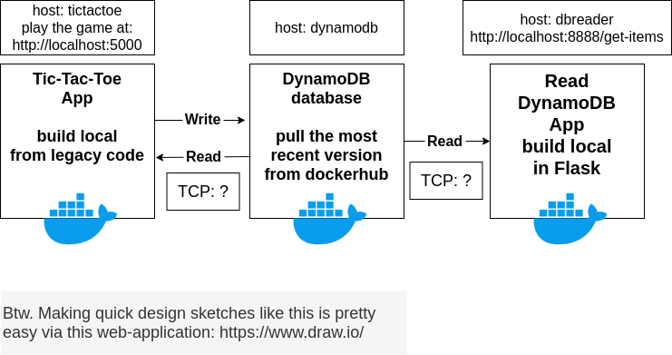

# Tic Tac Toe

Around 2015 Amazon launched a playful App; called Tic-Tac-Toe on DynamoDB. The App itself does exactly what it says. A database, DynamoDB, is used to keep track of the moves and scores. DynamoDB is a NoSQL database (its sort of a hybrid between key-value stores and json-documents), and one of AWS's most used services today.

While outdated, some history can be found here;
- [Tic-Tac-Toe on Github](https://github.com/aws-samples/dynamodb-tictactoe-example-app)
- [Article on AWS Dev guid](https://docs.aws.amazon.com/amazondynamodb/latest/developerguide/TicTacToe.Phase1.html)

## The Original App
One problem today is that the versions of Flask and Botos used in the 6-year old repository are outdated. Everything older than 3 years is rightfully labeled legacy these days. The Python version is 2.7, which is un-supported since 1 Januari 2020. 

Yet the original App is a pretty cool demo-case. The code seems to run fine in Python 3.x. But it's a pain to get some of those old libraries to get the connection to DynamoDB working. 

Docker makes wrapping the historic libraries alot easier. Observation here is that Docker Apps can stand the test of time more easily. At the time Docker was still to premature, so there is no Docker configuration. Fixing that should not be all that difficult though.

## DynamoDB
Besides the App, Amazon also provides DynamoDB Docker images. These are kept well updated, see [DynamoDB-local on Dockerhub](https://hub.docker.com/r/amazon/dynamodb-local).

We can simply pull the last version (1.12.0 at the time of wring) and use it locally on our platform..

## Read DynamoDB
While we are at it, we also want a separate dbreader App to show us what is in the database.

## Design

## Excercise
Most of the work is done and all code work(ed), but ... someone accidently threw away the docker-compose.yml file.   
Can you (re-)create it?

### Hints
- you may want to fix the services one by one, starting with the tictactoe app
- we remember the command for the tictactoe app should be defined as: 'python application.py --mode local --serverPort ${FLASK_DEFAULT_PORT} --port ${DYNAMODB_PORT}'
- to play the game you need one browser-session per player (incognito-mode is useful)
- ports exposed on the host must be unique per container, watch out for port collisions
- the dbreader App needs to know name of the Table, you may want to check: dbreader/app/aws_controller.py to get another hint
- for the dynamodb App to share its table among multiple docker instances, you must append '-sharedDb' to its commandline arguments
- to debug, adding FLASK_ENV=development to the environment of Flask Apps may be useful

If you pass within 15 minutes ... consider yourself a Docker Expert.
